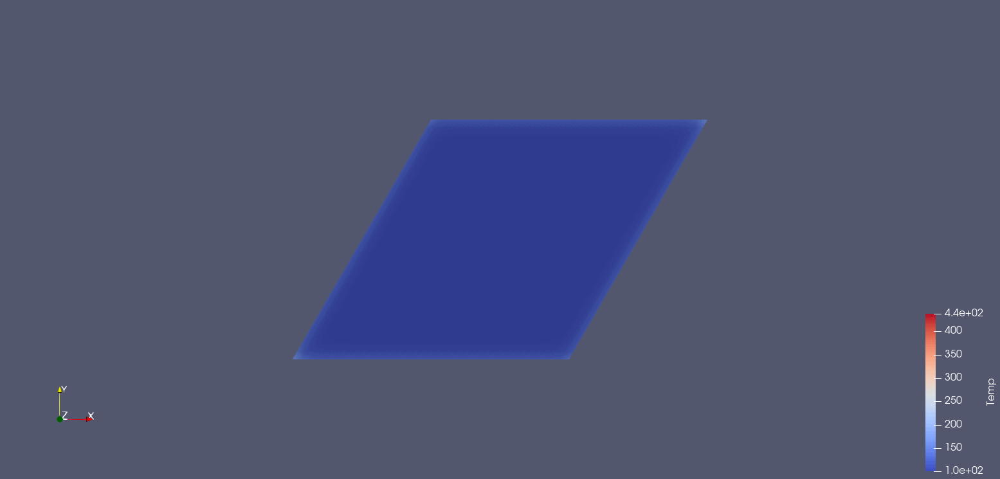

# Simulation of the non-stationary heat transfer
Program which simulates non-stationary heat transfer in 2D mesh using Finite Element Method.
Written as a project for FEM laboratory classes.
Main target is to calculate temperature vector for points in time during the heating process.
The program generates .vtk files and prints maximum and minimum temperature for time steps.

## Screenshots
### Grid 1

### Grid 2

### Grid 3

### Grid 4

